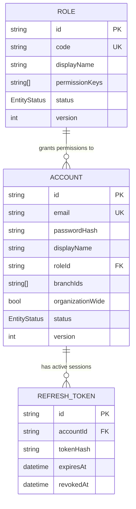

# Phase 1 Data Model: Backend Foundation

**Date**: 2026-08-02 | **Plan**: [plan.md](plan.md)

Three persisted tables and a set of shared type contracts. The tables exist solely so the
authentication mechanism is provable end to end (spec FR-015, decision C-1); **no endpoint may read
or write them** (FR-016).

---

## Base entity convention

Every business table created from now on carries these columns. Establishing the convention here is
the point — FR-014 exists so that eight modules do not each invent their own.

| Column | Type | Purpose |
|---|---|---|
| `id` | `String` `@id` UUID | UUID strings only; numeric IDs are prohibited (constitution binding §3.4) |
| `version` | `Int` default `1` | Optimistic concurrency. Compared against `expectedVersion`; incremented on every write |
| `status` | enum | Archival state, not deletion (Principle XV) |
| `archivedAt` | `DateTime?` | When archived; null while active |
| `createdAt` | `DateTime` | Server-owned |
| `updatedAt` | `DateTime` | Server-owned |

**Server-owned means server-owned**: a client-supplied value for any of these six is ignored, never
trusted. `version` is incremented by the repository layer, never by a service.

**Timestamps** are stored as `timestamptz` and serialized as ISO 8601 UTC with milliseconds.

---

## Table: `Account`

The minimal record an authenticating person maps to. Deliberately thin — the future Users module
extends this table by migration rather than replacing it (assumption A-011).

| Field | Type | Constraints | Notes |
|---|---|---|---|
| `id` | UUID string | PK | |
| `email` | String | **unique**, indexed | The sign-in identifier |
| `passwordHash` | String | required | argon2id output. Never selected into any response |
| `displayName` | String | required | Arabic text expected |
| `roleId` | UUID string | FK → `Role.id`, indexed | Single role per account, matching the frontend's `EmployeeContext` |
| `branchIds` | String[] | default `[]` | The caller's authorized branches (FR-048) |
| `organizationWide` | Boolean | default `false` | Bypasses branch scoping |
| `status` | `EntityStatus` | default `ACTIVE` | An archived account cannot authenticate (FR-037) |
| `version`, `archivedAt`, `createdAt`, `updatedAt` | | | Base convention |

**Validation rules**
- `email` — valid email format, normalized to lowercase before storage, unique. A duplicate raises
  the duplicate exception via `P2002` translation (FR-013).
- `passwordHash` — never accepted from input, never returned in any payload, never logged (FR-069).
- `branchIds` — stored as a scalar list. When `organizationWide` is true this list is not consulted.

**Why a scalar array rather than a join table**: branches do not exist as a table yet — the
Organization & Settings module owns them. A scalar list carries the scope the guard needs without
inventing a foreign key to a table that does not exist. When that module lands, this becomes a proper
relation by migration.

**State transitions**: `ACTIVE → INACTIVE → ARCHIVED`. Only `ACTIVE` accounts may authenticate.
Transitions have no endpoint in this feature; the seed creates an `ACTIVE` account directly.

---

## Table: `Role`

The minimal grouping carrying permission keys. The Roles module owns its full lifecycle later.

| Field | Type | Constraints | Notes |
|---|---|---|---|
| `id` | UUID string | PK | |
| `code` | String | **unique** | Stable machine identifier, e.g. `internal-employee` |
| `displayName` | String | required | Arabic text expected |
| `permissionKeys` | String[] | default `[]` | Namespaced `module[.resource].action` keys (FR-047) |
| `status` | `EntityStatus` | default `ACTIVE` | |
| `version`, `archivedAt`, `createdAt`, `updatedAt` | | | Base convention |

**Relationships**: `Role 1 —— * Account`.

**Validation rules**
- `code` — unique, lowercase kebab-case.
- `permissionKeys` — each entry must match the namespaced key format. The foundation validates the
  *shape*; it does not validate membership in the 125-key catalogue, because the catalogue arrives
  with the Users/Roles module (assumption A-007).

**Why a scalar array rather than a permissions table**: the same reasoning as `branchIds`. The
permission catalogue is owned by a module that does not exist. A scalar list satisfies the guard's
only question — "does this caller hold key X?" — without a speculative schema.

---

## Table: `RefreshToken`

The persisted state that makes a long-lived credential revocable. Without it, sign-out could not
truly end a session (FR-038, FR-039).

| Field | Type | Constraints | Notes |
|---|---|---|---|
| `id` | UUID string | PK | Also the JWT's `jti` claim |
| `accountId` | UUID string | FK → `Account.id`, indexed, cascade delete | |
| `tokenHash` | String | required | **A hash of the token, not the token.** A leaked database must not yield usable credentials |
| `expiresAt` | `DateTime` | indexed | |
| `revokedAt` | `DateTime?` | null while valid | |
| `createdAt` | `DateTime` | | |

**Deliberately not following the base convention**: this is an operational record, not a business
entity. It has no `version` (never concurrently edited), no `status` (`revokedAt` is the state), and
is the one table where hard deletion is correct — expired rows are pruned, not archived. Principle XV
says "wherever the domain allows it"; retaining dead credentials forever serves no reporting or audit
purpose and enlarges the blast radius of a breach.

**Validation rules**
- A refresh credential is valid only when a row exists with matching `id`, matching `tokenHash`,
  `expiresAt` in the future, and `revokedAt` null. Any other state is a refusal (FR-038).
- Revocation sets `revokedAt`; it does not delete the row, so a replayed credential is distinguishable
  from an unknown one.

---

## Enum: `EntityStatus`

```
ACTIVE | INACTIVE | ARCHIVED
```

Mirrors the frontend's `EntityStatus = "active" | "inactive" | "archived"`. Serialized lowercase at
the API boundary to match the requirements document; the mapping lives in the repository layer.

---

## Entity relationship



---

## Seed data (FR-017)

Idempotent via `upsert` on the natural keys, so repeated runs converge rather than duplicate
(FR-011).

| Record | Natural key | Values |
|---|---|---|
| Role | `code = "internal-employee"` | Arabic display name; permission keys limited to what the foundation's own tests need |
| Account | `email` from configuration | Password from configuration, hashed with argon2id at seed time; linked to the seeded role; `organizationWide = false` with one placeholder branch id, so branch scoping is exercisable |

The seeded account exists to make the mechanism testable. It is not a production provisioning path
(assumption A-010), and its credentials come from configuration rather than being hardcoded.

---

## Shared type contracts (not persisted)

These are TypeScript contracts in `src/shared/types/`. They carry no table, but every future module
depends on them, so they are specified here rather than left to improvisation.

### `Money`

```
{ amount: string;   // decimal string, e.g. "18000.00" — never a number
  currency: string; // ISO 4217, e.g. "EGP"
  precision: number } // minor-unit digits, e.g. 2
```

Arithmetic converts to integer minor units. Floating-point money is prohibited (FR-074). Database
columns use `NUMERIC`, converted to string at the repository boundary (research D-15).

### `CallerContext`

```
{ accountId: string; displayName: string; email: string;
  role: { id: string; code: string; permissionKeys: string[] };
  authorizedBranchIds: string[];
  organizationWide: boolean;
  authenticatedAt: string }  // ISO 8601 UTC
```

Request-scoped, produced by the auth guard from a verified credential. **Empty rather than absent**
when no credential is present (FR-033) — this is what lets a session-restore endpoint return a
successful empty result instead of an authentication error.

### `FileDescriptor`

```
{ id: string; fileName: string; originalName: string;
  mimeType: string; size: number; url: string }
```

The only representation of a file business code ever handles (FR-054). Matches the requirements
document §7.2 response shape exactly.

### Pagination

```
PageQuery  { page: number; pageSize: number }        // request; defaults 1 / 20, max 100
PageResult<T> { items: T[]; total: number; page: number; pageSize: number; totalPages: number }
CursorResult<T> { items: T[]; nextCursor?: string }  // timeline reads only
```

`PageResult` is what repositories return; the envelope interceptor converts it to the wire `meta`
shape, where `pageSize` becomes `limit` (constitution binding, TODO(PAGE_SIZE_NAMING)).

### `DomainEvent`

```
{ name: string; occurredAt: string;
  actor: { accountId: string } | null;
  target: { type: string; id: string };
  operation: string;
  payload: Record<string, unknown> }
```

Emitted by business operations for later audit recording (FR-071). No subscriber is registered in
this feature — that is the point of Principle X: audit can be added later without touching business
logic.

---

## What is deliberately absent

Recorded so a reader does not mistake omission for oversight:

- **No `Branch`, `Organization`, `Permission`, or `PermissionCatalogue` table.** Owned by the
  Organization & Settings and Users/Roles modules.
- **No audit log table.** Principle X requires only that operations *emit* events; persistence
  arrives later without modifying business logic.
- **No idempotency-key table.** FR-058 requires the *mechanism*; the first module with a real upload
  surface chooses its persistence.
- **No `File` table.** File descriptors are persisted on the parent record that owns them, per the
  requirements document §7.2.
